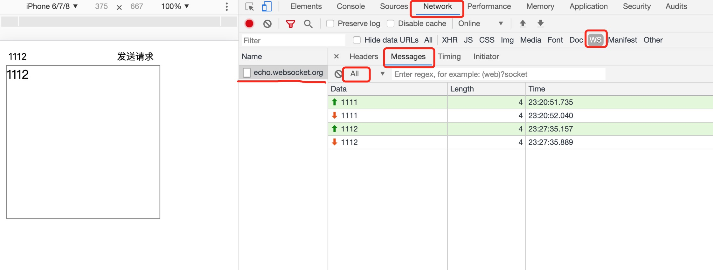

## WebSocket 学习笔记
-- [官方地址](https://developer.mozilla.org/zh-CN/docs/Web/API/WebSocket)
https://developer.mozilla.org/zh-CN/docs/Web/API/WebSocket
## 显示WebSocket在浏览器端如何使用
1) h5 已经直接提人工工人了 WebSocket 的API,所以我们可以直接去使用
   跟Date() Math 一样:
   1.创建websocket => 直接new WebSocket()
    参数1 : websocket 服务地址
    ```
    var socket = new WebSocket('ws://echo.websocket.org') // 'ws://echo.websocket.org' 为官方默认给的服务地址
    ```

```
/*ps:中间提交的时候遇到权限报错403 
解决方案：
step1：终端=> vim .git/config
————————————————*/
[core]
	repositoryformatversion = 0
	filemode = false
	bare = false
	logallrefupdates = true
	symlinks = false
	ignorecase = true
[remote "origin"]
	url = git@github.com:github的名字/库的名字.git
	fetch = +refs/heads/*:refs/remotes/origin/*
[branch "master"]
	remote = origin
	merge = refs/heads/master

————————————————//再次push 应该就能拨开云雾见天日了
```


